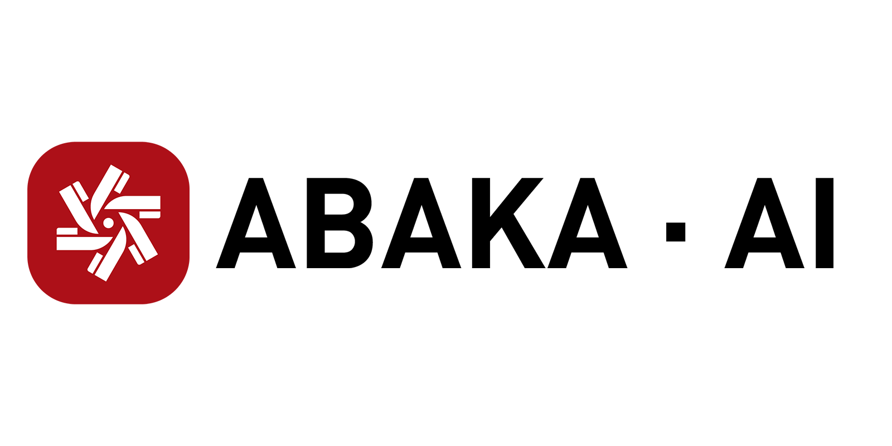

<div align="center">
  
  <div>&nbsp;</div>
  <div align="center">
    <span><font size="150">ABAVA website</font></span>
    <sup>
      <a href="https://www.abaka.ai/">
        <i><font size="5">HOT</font></i>
      </a>
    </sup>
  </div>
  <div>&nbsp;</div>

[](https://pypi.org/project/Abava-SDK/)
[](README.md)
[](LICENSE)


</div>


# ABAVA Data SDK | For Python
Welcome to `ABAVA SDK`, an open-source Software Development Kit that forms the backbone of the ABAVA platform. Designed to convert data between ABAVA’s native format and widely-used, universal data structures such as COCO, YOLO, LABELME, KITTI, VOC, ABAVA SDK helps to streamline and simplify your data operations.

The SDK is more than just a converter. It’s a swiss army knife of data processing tools. It comes loaded with an assortment of handy utility functions often used in data processing workflows, such as Calculate the area of a polygon or determine if a point is inside a polygon.

Whether you’re moving data, cleaning data, transforming data, or just managing it, the ABAVA SDK has got you covered with powerful features that make your work simpler and easier. Built for developers, engineers and data scientists, this SDK aims to make your data-heavy processes more seamless and efficient.

Stay tuned to get more details about the features, capabilities, and the simplicity ABAVA SDK brings to your data operations. 

Learn more about ABAVA [here](https://www.abaka.ai/)! 
## Overview
- [Requirements](#requirements)
- [Installation](#installation)
- [What can we do](#what-can-we-do)
- [Usage](#usage)
- [Changelog](#changelog)
- [Contact us](#contact-us)
- [License](#license)

## requirements
```sh
python==3.9
lxml~=4.9
numpy~=1.25
opencv_python~=4.8
Pillow~=10.0
Requests~=2.31
tqdm~=4.66
dynaconf~=3.2
```
## Installation
### Install with PyPi (pip)
```sh
pip install abava-sdk
```

## What can we do
### Data Format
+ [ABAVA data -> COCO data](https://github.com/ABAKA-AI/abavasdk/blob/main/abava/export_format/coco/export_coco.py)
+ [ABAVA data -> LABELME data](https://github.com/ABAKA-AI/abavasdk/blob/main/abava/export_format/labelme/export_labelme.py)
+ [ABAVA data -> VOC data](https://github.com/ABAKA-AI/abavasdk/blob/main/abava/export_format/voc/export_voc.py)
+ [ABAVA data -> YOLO data](https://github.com/ABAKA-AI/abavasdk/blob/main/abava/export_format/yolo/export_yolo.py)
+ [ABAVA data -> KITTI data](https://github.com/ABAKA-AI/abavasdk/blob/main/abava/export_format/kitti/export_kitti.py)
+ [ABAVA data -> MASK](https://github.com/ABAKA-AI/abavasdk/blob/main/abava/export_format/mask/generate_mask.py)

### Data Check
+ [count labels number](https://github.com/ABAKA-AI/abavasdk/blob/main/abava/check/statistics.py#L10)
+ [count specific labels number](https://github.com/ABAKA-AI/abavasdk/blob/main/abava/check/statistics.py#L20)
+ [count drawtype number](https://github.com/ABAKA-AI/abavasdk/blob/main/abava/check/statistics.py#L32)
+ [count file number](https://github.com/ABAKA-AI/abavasdk/blob/main/abava/check/statistics.py#L45)
+ [count image number](https://github.com/ABAKA-AI/abavasdk/blob/main/abava/check/statistics.py#L61)
+ [count unlabeled image number](https://github.com/ABAKA-AI/abavasdk/blob/main/abava/check/statistics.py#L72)
+ [count labeled image number](https://github.com/ABAKA-AI/abavasdk/blob/main/abava/check/statistics.py#L89)

### Data Visualization
+ [visual ABAVA data](https://github.com/ABAKA-AI/abavasdk/blob/main/abava/visualize/source/visual_source.py)
+ [visual COCO data](https://github.com/ABAKA-AI/abavasdk/blob/main/abava/visualize/coco/visual_coco.py)
+ [visual LABELME data](https://github.com/ABAKA-AI/abavasdk/blob/main/abava/visualize/labelme/visual_labelme.py)
+ [visual VOC data](https://github.com/ABAKA-AI/abavasdk/blob/main/abava/visualize/voc/visual_voc.py)
+ [visual YOLO data](https://github.com/ABAKA-AI/abavasdk/blob/main/abava/visualize/yolo/visual_yolo.py)

### Computer Vision tools
+ [image data -> base64](https://github.com/ABAKA-AI/abavasdk/blob/main/abava/utils/cv_tools.py#L15) 
+ [base64 -> image data](https://github.com/ABAKA-AI/abavasdk/blob/main/abava/utils/cv_tools.py#L29)
+ [read url image](https://github.com/ABAKA-AI/abavasdk/blob/main/abava/utils/cv_tools.py#L41)
+ [get url image size](https://github.com/ABAKA-AI/abavasdk/blob/main/abava/utils/cv_tools.py#L54)
+ [hexadecimal color values -> RGB](https://github.com/ABAKA-AI/abavasdk/blob/main/abava/utils/cv_tools.py#L67)
+ [generate random RGB values](https://github.com/ABAKA-AI/abavasdk/blob/main/abava/utils/cv_tools.py#L80)
+ [drawing boxes on the image](https://github.com/ABAKA-AI/abavasdk/blob/main/abava/utils/cv_tools.py#L87)
+ [drawing points on the image](https://github.com/ABAKA-AI/abavasdk/blob/main/abava/utils/cv_tools.py#L110)
+ [drawing polygons on the image](https://github.com/ABAKA-AI/abavasdk/blob/main/abava/utils/cv_tools.py#L127)
+ [plate mode MASK -> POLYGON](https://github.com/ABAKA-AI/abavasdk/blob/main/abava/utils/cv_tools.py#L216)
+ [MASK -> RLE](https://github.com/ABAKA-AI/abavasdk/blob/main/abava/utils/cv_tools.py#L231)
+ [RLE -> MASK](https://github.com/ABAKA-AI/abavasdk/blob/main/abava/utils/cv_tools.py#L244)
+ [POLYGON -> MASK](https://github.com/ABAKA-AI/abavasdk/blob/main/abava/utils/cv_tools.py#L262)
+ [determine if the point is inside the outer rectangle](https://github.com/ABAKA-AI/abavasdk/blob/main/abava/utils/cv_tools.py#L278)
+ [determine if the point is inside the polygon](https://github.com/ABAKA-AI/abavasdk/blob/main/abava/utils/cv_tools.py#L334)
+ [calculate the polygon area](https://github.com/ABAKA-AI/abavasdk/blob/main/abava/utils/cv_tools.py#L414)
+ [determining the containment of polygons](https://github.com/ABAKA-AI/abavasdk/blob/main/abava/utils/cv_tools.py#L431)
+ [skeleton polygon](https://github.com/ABAKA-AI/abavasdk/blob/main/abava/utils/cv_tools.py#L559)
+ [Determining Polygon Orientation](https://github.com/ABAKA-AI/abavasdk/blob/main/abava/utils/cv_tools.py#L604)
+ [image de-distortion](https://github.com/ABAKA-AI/abavasdk/blob/main/abava/utils/cv_tools.py#L636)

### Point Cloud tools
+ [read PCD format point clouds](https://github.com/ABAKA-AI/abavasdk/blob/main/abava/utils/pc_tools.py#L13)
+ [write PCD format point clouds](https://github.com/ABAKA-AI/abavasdk/blob/main/abava/utils/pc_tools.py#L92)
+ [PCD -> BIN](https://github.com/ABAKA-AI/abavasdk/blob/main/abava/utils/pc_tools.py#L121)
+ [BIN -> PCD](https://github.com/ABAKA-AI/abavasdk/blob/main/abava/utils/pc_tools.py#L137)
+ [removing points from the point cloud 3D box](https://github.com/ABAKA-AI/abavasdk/blob/main/abava/utils/pc_tools.py#L160)
+ [voxel subsampling for points outside the intensity range](https://github.com/ABAKA-AI/abavasdk/blob/main/abava/utils/pc_tools.py#L191)
+ [random subsampling for points outside the intensity range](https://github.com/ABAKA-AI/abavasdk/blob/main/abava/utils/pc_tools.py#L211)
+ [the pnp method computes rotation matrices and translation vectors](https://github.com/ABAKA-AI/abavasdk/blob/main/abava/utils/pc_tools.py#L231)
+ [calculate the number of points in the 3D box](https://github.com/ABAKA-AI/abavasdk/blob/main/abava/utils/pc_tools.py#L252)
+ [rotation matrix -> quaternion](https://github.com/ABAKA-AI/abavasdk/blob/main/abava/utils/pc_tools.py#L281)
+ [rotation matrix -> euler](https://github.com/ABAKA-AI/abavasdk/blob/main/abava/utils/pc_tools.py#L295)
+ [euler -> rotation matrix](https://github.com/ABAKA-AI/abavasdk/blob/main/abava/utils/pc_tools.py#L308)
+ [quaternion -> rotation matrix](https://github.com/ABAKA-AI/abavasdk/blob/main/abava/utils/pc_tools.py#L334)
+ [euler -> quaternion](https://github.com/ABAKA-AI/abavasdk/blob/main/abava/utils/pc_tools.py#L364)
+ [quaternion -> euler](https://github.com/ABAKA-AI/abavasdk/blob/main/abava/utils/pc_tools.py#L379)

## Usage
### get source data

```python
import abava

"""
You can get your ak/sk in the platform's "Team Space" -> "Setting"
"""
ak = Access Key
sk = Secret Key
client = abava.Client(ak, sk)

"""
After creating an export task, you can see the export task id of the corresponding task 
in "Import/Export"->"Data Export".
"""
source_data = client.get_data(export_task_id)
```
### data format

```python
from abava import Export

mapping = {"背景background": 'background', "草地lawn": 'lawn', "道路road": 'road'}
# coco
out_path = "./output"
Export.abava_json2coco(source_data=source_data, out_path=out_path)

```

### visualize

```python
from abava import Visual

data_path = "./data.json"
out_path = "./output"
Visual.visual_coco(source_data, data_path, out_path)
```

### utils
```python
def test_isin_external_rectangle():
    point = [55, 100]
    vertex_lst = [[50,50], [200,200], [200,50], [50,50]]
    tag = abava.isin_external_rectangle(point, vertex_lst)
    return tag


def test_to_string():
    test_string = b'example_string'
    string = abava.b2string(test_string)
    print(string)


def test_pcd2bin():
    bin_path = './bin'
    pcd_path = './pcd'
    abavadata.pcd2bin(pcd_path, bin_path)
```
Please refer to [examples.md](example/examples.md) to learn more usage about ABAVA SDK.

## Changelog

[2023-11-29] Updated
+ Optimize mask export

[2023-10-12] New features:
+ Support for interconversion of Euler angles, quaternions and rotation matrices

[2023-08-31] New features:
+ Support pinhole camera image de-distortion and fisheye camera image de-distortion
+ Support point cloud random subsampling and voxel subsampling
+ Support for removing points in the 3D box of the point cloud
+ Support Quaternion to Euler angle
+ Support PNP <br>

[2023-07-21] ABAVA SDK v1.0.0 is released. <br>

## Contact Us

+ wxj@molardata.com

## License

ABAVA SDK is released under the MIT license.
